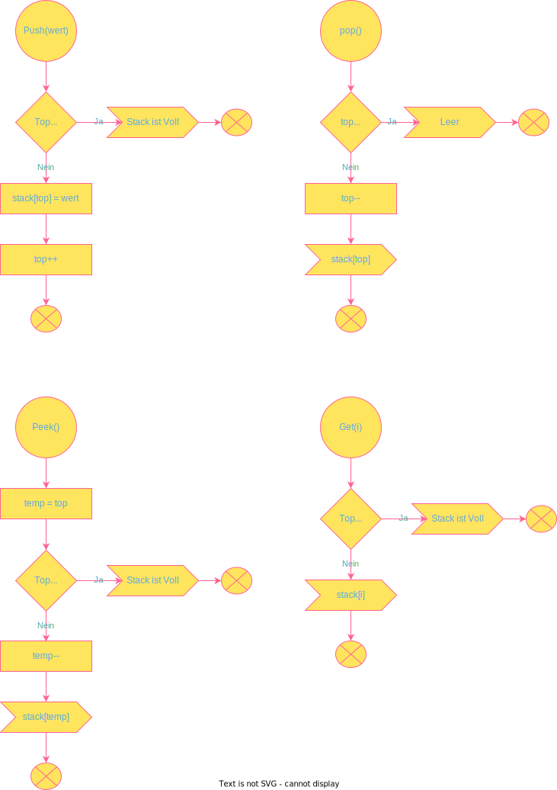
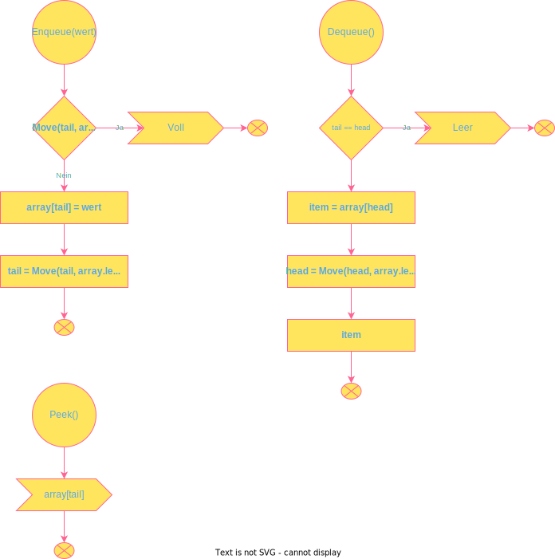
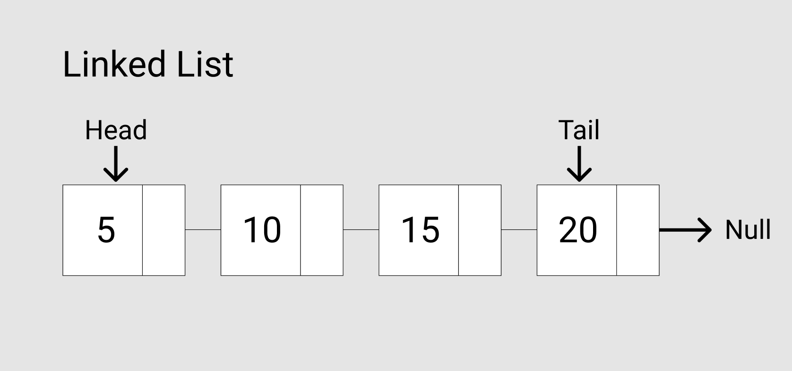
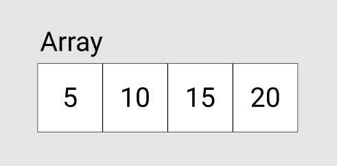
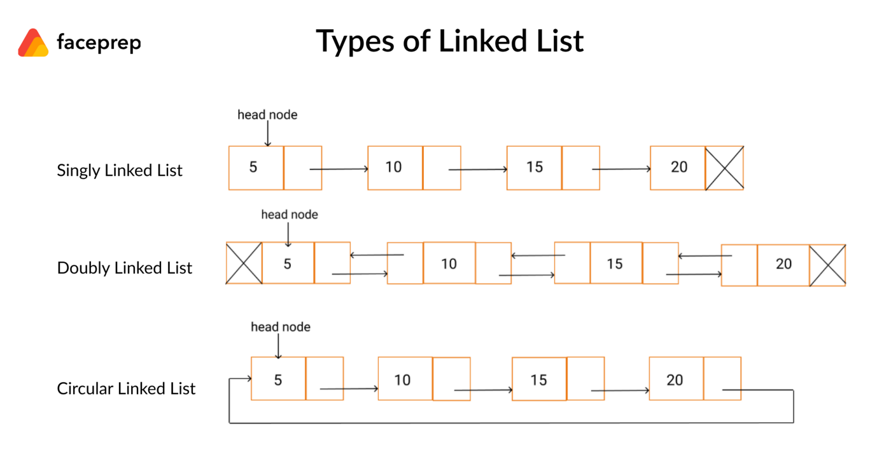
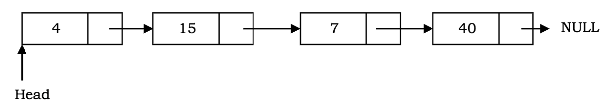

<h1 align="center">Stack Queue LinkedList</h1>

Datenstrukturen sind wichtige Themen, nach denen man oft in technischen Interviews gefragt wird, die aber auch die Problemlösungsfähigkeiten bei Algorithmen fördern. Es gibt viele Möglichkeiten, eine Algorithmusfrage zu lösen, um das Ergebnis zu erhalten. Manchmal können Sie die Frage auf die harte oder die einfache Art lösen, und alles hängt von Ihrem Wissen über Datenstrukturen ab. Manchmal ist die Lösung auch nicht optimal, weil man das grundlegende Konzept der Datenstrukturen nicht kennt. Beginnen wir also damit, die beiden häufigsten Datenstrukturen in der Informatik kennenzulernen: Stack and Queue und LinkedList.


# Was ist ein Stapel?

Das letzte Element, das dem Stapel hinzugefügt wird, ist das erste Element, das vom Stapel entfernt wird. Das Mantra der LIFO-Methode (Last In First Out) macht den Stapel bekannt. Im wirklichen Leben könnte ein Stapel von Tellern, Büchern und Papieren ein Beispiel für einen Stapel sein. Um die Mitte eines Bücherstapels zu erreichen, müssen Sie zuerst das Buch entfernen, das oben auf dem Stapel liegt. Das bedeutet, dass das letzte Buch in einem Stapel das erste Buch ist, das aus der Sammlung entfernt wird (das oberste Buch). 

Ein Stapel hat zwei Hauptoperationen, die nur am Anfang des Stapels stattfinden: Push und Pop. Die Push-Operation setzt ein Element an die Spitze des Stapels, während die Pop-Operation ein Element von der Spitze des Stapels entfernt.

Der Name Stack kommt von der Analogie zu einer Reihe von physischen Objekten, z. B. DVDs, Bücher, die übereinander gestapelt sind.

Ein Stapel hat viele Anwendungen. Am einfachsten ist es zum Beispiel, ein Wort umzudrehen. Dazu schiebt man ein Wort Buchstabe für Buchstabe in den Stapel und holt die Buchstaben vom Stapel. oder Stapel werden verwendet, wo:

- Verwaltung der Funktionsaufrufe, Rekursionsfunktion
- Undo/Redo, (die "Steuerung + z" oder "Befehl + z")
- Routing Route (die Geschichte Objekt) in Front-End-Framework wie React

## push()-Method

Die Methode push() kann verwendet werden, um ein oder mehrere Elemente am Ende des Arrays hinzuzufügen. Die Methode push() gibt den Wert der Eigenschaft length zurück, die die Anzahl der Elemente im Array angibt.

Die folgende Abbildung veranschaulicht jeden Schritt im obigen Skript.


Anfangs ist der Stack leer. Rufen Sie jedes Mal die Methode push() auf, um dem Stack eine Zahl hinzuzufügen. Nach 5 Aufrufen hat der Stack 5 Elemente.
## pop()-Method


Die pop()-Methode entfernt das Element am Ende des Arrays und gibt das Element an den Aufrufer zurück. Wenn das Array leer ist, gibt die pop()-Methode einen undefinierten Wert zurück.


Zu Beginn hat der Stapel 5 Elemente. Die Methode pop() entfernt das Element am Ende des Arrays, d.h. am oberen Ende des Stapels, eines nach dem anderen. Nach fünf Operationen ist der Stapel leer.

----

Nachdem wir nun das Konzept verstanden haben, wollen wir einen Stack mit einem Array implementieren. Es gibt mehr als eine Möglichkeit, einen Stack zu realisieren.

Hier ist meine Version in C#:


```C#
    class Stack {
        public bool makeBigger;
        public aStack(bool _makeBigger) {
            makeBigger = _makeBigger;
        }

        aArray<string> aAr = new aArray<string>();

        static string[] stack = new string[10];
        static int top = 0;
        public void push(string Wert) {
            if (top >= stack.Length) {
                if (makeBigger == true) {
                    stack = aAr.IncreaseSize(stack, 10);
                    stack[top] = Wert;
                    top++;
                    return;
                }

                throw new Exception("Stack is full");
            }
            stack[top] = Wert;
            top++;

        }

        public string pop() {
            if (top <= 0) {
                throw new Exception("Stack is full");
                return null;
            }
            top--;
            return stack[top];
        }

        public string peek() {
            int temp = top;

            if (top <= 0) {
                throw new Exception("Stack is full");
                return null;
            } else {
                temp = temp - 1;
            }
            return stack[temp];
        }
        public string get(int i) {
            if (top <= 0) {
                throw new Exception("Stack is full");
                return null;
            } else {
                return stack[i];
            }
        }
        public void clean(){
            stack = new string[10];
        }
    }
```

## Flussdiagram




# Was ist eine Warteschlange?

Eine Warteschlange ist ähnlich wie ein Stapel, funktioniert aber umgekehrt. First In First Out (FIFO) ist dasselbe wie Last In Last Out (LILO). Stellen Sie sich vor, Sie stehen in einer Warteschlange bei der Zulassungsstelle. Die Person, die als erste reinkommt, ist oft auch die erste, die wieder rauskommt. Warteschlangen werden wo verwendet:

- In einem Online-Videospiel, wo jemand als Letzter und jemand als Erster einsteigt.
- Hochladen von Ressourcen (Herunter- und Hochladen von Dateien auf den Computer, abhängig von der Größe der Datei)
- Hintergrundaufgaben auf Ihrem Computer
- Drucken/Aufgabenbearbeitung (ein Drucker kann immer nur eine Sache auf einmal verarbeiten, und wer in der öffentlichen Bibliothek zuerst auf den Druckknopf drückt, bekommt seine Sachen zuerst gedruckt)


Es gibt zwei Begriffe in einer Warteschlange: Enqueue und Dequeue. Eine Enqueue ist das Einfügen und eine Dequeue ist das Löschen eines Elements. Nachdem wir nun das Gesamtbild verstanden haben, wollen wir uns nun mit der Implementierung beschäftigen. Auch hier gibt es viele Möglichkeiten der Implementierung von Warteschlangen.

Hier ist meine Version in C#:

```C#
   class queue {
        public bool makeBigger;
        public queue(bool _makeBigger) {
            makeBigger = _makeBigger;
        }

        aArray<string> aAr = new aArray<string>();

        static string[] array = new string[5];

        static int tail = 0;
        static int head = 0;

        public void Enqueue(string Wert) {
            if (Move(tail, array.Length) == head) {
                if (makeBigger == true) {
                    array = aAr.IncreaseSize(array, 10);
                    array[tail] = Wert;
                    tail = Move(tail, array.Length);
                    return;
                }
                Console.WriteLine("Voll");
                return;
            } else {
                array[tail] = Wert;
                tail = Move(tail, array.Length);
            }
        }

        public string Dequeue() {
            string answer = "";
            if (tail == head) {
                return "leer";
            }
            answer = array[head];
            head = Move(head, array.Length);
            return answer;
        }
        private int Move(int counter, int length) {
            if (counter > length - 1) {
                return 0;
            }
            return ++counter;
        }
    }
```
Eine weitere wichtige Operation einer Warteschlange ist das Abrufen des Elements an der Spitze, genannt peek . Im Gegensatz zur Dequeue-Operation gibt die Peek-Operation das Element an der Spitze zurück, ohne die Warteschlange zu verändern.

Der Name Warteschlange kommt von der Analogie zu einer Kundenwarteschlange in einer Bank. Der Kunde, der zuerst kommt, wird zuerst bedient, und der Kunde, der später kommt, wird an das Ende der Warteschlange gestellt und später bedient.


## Flussdiagram


---
# What is a Linked List?

Eine verkettete Liste ist eine geordnete Sammlung von Datenelementen. Ein Datenelement kann als ein Knoten in einer verketteten Liste dargestellt werden. Jeder Knoten besteht aus zwei Teilen: Daten und Zeiger auf den nächsten Knoten. Sehen Sie sich die Abbildung unten an:
<div style="display: flex; flex-direction: row; margin-top: 56px;" >

     
</div>
<br>
Der Kopf, der auf den ersten Knoten (Element) in der verknüpften Liste zeigt, enthält auch den Eintrag der verknüpften Liste. Der letzte Knoten der Liste zeigt auf null, was auch das Ende ist. Das Ende ist ein bestimmter Knoten, bei dem der nächste Zeiger immer auf null zeigt oder auf null verweist, was das Ende der Liste anzeigt. Wenn die Liste leer ist, zeigt der Kopf auf die Null.

Linked List visualization in javascript:

```Js
const Linkedlist = {
    head: {
        value: 6
        next: {
            value: 10                                             
            next: {
                value: 12
                next: {
                    value: 3
                    next: null	
                    }
                }
            }
        }
    },
    tail:{
        value:null,
        next:null
    }
}
```

## Vorteil
  Die Einfüge- und Löschoperationen in der verketteten Liste sind mit einer Zeitkomplexität von O(1) schneller als in einem Array. Im Gegensatz zu einem Array können Knoten in einer verketteten Liste leicht entfernt und hinzugefügt werden, ohne dass die gesamte Datenstruktur reorganisiert werden muss.


## Nachteil
- Der Suchvorgang ist langsamer als bei einem Array, da der Zugriff auf die Knoten vom ersten Knoten an erfolgt und jeder Knoten einzeln durchlaufen werden muss, um das Element zu finden. Im Gegensatz dazu können wir bei Arrays auf das Datenindex-Element nach dem Zufallsprinzip zugreifen (z. B. array[4], nicht im Fall der verknüpften Liste).
- Bei verknüpften Listen wird mehr Speicher für die Speicherung zusätzlicher Zeiger benötigt als bei Arrays.

## Drei Arten von Linked Listen
- **Einfach Linked Listen**: jeder Knoten verweist nur auf den nächsten Knoten. Das obige Beispiel ist eine einfach verkettete Liste.
- **Doubly Linked Lists**: Jeder Knoten hat zwei Zeiger, einen Zeiger auf den nächsten Knoten und einen Zeiger auf den vorherigen Knoten.
- **Circular Linked Lists**: Ähnlich wie eine einfach verknüpfte Liste, mit dem Unterschied, dass der letzte Knoten auf den ersten Knoten der Liste zeigt und eine Schleife bildet.
 



Im Gegensatz zu Arrays werden die Datenelemente nicht an zusammenhängenden Stellen gespeichert. Die Datenelemente oder Knoten werden mit Hilfe von Zeigern verknüpft und daher als verknüpfte Liste bezeichnet.

Eine verknüpfte Liste hat die folgenden Eigenschaften: 
- Aufeinanderfolgende Knoten sind durch Zeiger verbunden.
- Der letzte Knotenpunkt zeigt auf Null.
- Am Kopf der Liste befindet sich ein Zeiger, der auf den ersten Knoten der Liste verweist.
- Eine verkettete Liste kann während der Ausführung des Programms wachsen und schrumpfen.
- Sie kann so lang wie nötig gemacht werden.
- Sie weist Speicher zu, wenn die Liste wächst. Im Gegensatz zu Arrays, die eine feste Größe haben. Daher muss die Obergrenze für die Anzahl der Elemente im Voraus bekannt sein. Im Allgemeinen entspricht der zugewiesene Speicher der Obergrenze, unabhängig von der Verwendung. Dies ist einer der Hauptvorteile einer verknüpften Liste gegenüber einem Array.

## Ein weiterer Vorteil einer verketteten Liste

Im Gegensatz zu einem Array, das Daten zusammenhängend im Speicher speichert, können bei einer verketteten Liste problemlos Knoten in die Liste eingefügt oder aus ihr entfernt werden, ohne dass die gesamte Datenstruktur neu organisiert werden muss.

Wenige Nachteile: Der zufällige Zugriff auf Datenelemente ist nicht möglich. Der Zugriff auf die Knoten muss sequentiell erfolgen, beginnend mit dem ersten Knoten. Daher ist der Suchprozess in einer verknüpften Liste langsam. Der Speicherbedarf ist höher als bei Arrays, da die Zeiger mehr Speicherplatz benötigen.

## Einfache verkettete Liste

Eine einfach verkettete Liste ist eine Sammlung von Knoten, bei der jeder Knoten aus zwei Teilen besteht: Daten und einen Zeiger auf den nächsten Knoten. Die Liste endet mit einem Knoten, der auf Null zeigt.



## Flussdiagram


Resources:


[](https://www.youtube.com/watch?v=WwfhLC16bis)

Es geht um die Implementierung von Stack und Queue in einem Array und einer Linked List. Ich danke Ihnen für die Lektüre und hoffe, Sie können etwas aus dem Artikel lernen.
