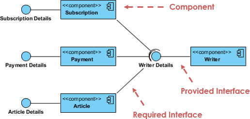

# Was ist Unified Modeling Language ( UML )?

UML, Kurz für Unified Modeling Language ist eine standardisierte Modelliersprache, die aus einem integrierten Satz von Diagrammen besteht und System- und Softwareentwicklern beim Festlegen, Visualisieren, Erstellen, und Dokumentation der Artefakte von Softwaresystemen sowie für die Geschäftsmodellierung und andere Nicht-Software-Systeme. Die UML stellt eine Sammlung bewährter technischer Verfahren dar, die sich bei der Modellierung großer und komplexer Systeme als erfolgreich erwiesen haben. Die UML ist ein sehr wichtiger Bestandteil der Entwicklung objektorientierter Software und des Softwareentwicklungsprozesses. Die UML verwendet hauptsächlich grafische Notationen, um das Design von Softwareprojekten auszudrücken. Mithilfe der UML können Projektteams kommunizieren, potenzielle Designs erkunden und das architektonische Design der Software validieren. In diesem Artikel geben wir Ihnen detaillierte Ideen zu UML,den Verlauf von UML und eine Beschreibung jedes UML-Diagrammtyps sowie UML-Beispiele.

# Der Ursprung von UML
Ziel von UML ist es, eine Standardnotation bereitzustellen, die von allen objektorientierten Methoden verwendet werden kann, und die besten Elemente von Vorläufernotationen auszuwählen und zu integrieren. UML wurde für eine breite Palette von Anwendungen entwickelt. Daher bietet es Konstrukte für ein breites Spektrum von Systemen und Aktivitäten (, z. B. verteilte Systeme, Analyse, Systemdesign und Bereitstellung ).

# UML ist eine Notation, die sich aus der Vereinigung von OMT von ergibt

- Objektmodellierungstechnik OMT [James Rumbaugh 1991 ] - war am besten für Analyse- und datenintensive Informationssysteme geeignet.
- Booch [Grady Booch 1994 ] - war hervorragend für Design und Implementierung. Grady Booch hatte ausgiebig mit dem gearbeitet Ada Sprache und war ein wichtiger Akteur bei der Entwicklung objektorientierter Techniken für die Sprache. Obwohl die Booch-Methode stark war, wurde die Notation weniger gut aufgenommen. ( Viele Wolkenformen dominierten seine Modelle - nicht sehr ordentlich )
- OOSE ( Objektorientierte Softwareentwicklung [Ivar Jacobson 1992 ] ) - enthielt ein Modell namens Use Cases. Anwendungsfälle sind eine leistungsstarke Technik zum Verständnis des Verhaltens eines gesamten Systems (, eines Bereichs, in dem OO traditionell schwach war ).

1994 betäubte Jim Rumbaugh, der Schöpfer von OMT, die Softwarewelt, als er General Electric verließ und zu Grady Booch bei Rational Corp. kam. Ziel der Partnerschaft war es, ihre Ideen zu einer einheitlichen Methode ( zusammenzuführen. Der Arbeitstitel für die Methode war in der Tat die "einheitliche Methode" ).

Bis 1995 hatte sich auch der Schöpfer von OOSE, Ivar Jacobson, Rational und seinen Ideen ( angeschlossen, insbesondere dem Konzept der "Verwendungsfälle") wurden in die neue Unified Method eingespeist - jetzt Unified Modeling Language1 genannt. Das Team von Rumbaugh, Booch und Jacobson ist liebevoll als "Drei Amigos" bekannt"

UML wurde auch durch andere objektorientierte Notationen beeinflusst:

- Mellor und Shlaer [ 1998 ]
- Coad und Yourdon [ 1995 ]
- Wirfs-Brock [ 1990 ]
- Martin und Odell [ 1992 ]

UML enthält auch neue Konzepte, die zu diesem Zeitpunkt in anderen wichtigen Methoden nicht vorhanden waren, wie z. B. Erweiterungsmechanismen und eine Einschränkungssprache.

# Warum UML
Da der strategische Wert von Software für viele Unternehmen steigt, sucht die Branche nach Techniken, um die Produktion von Software zu automatisieren, die Qualität zu verbessern und Kosten und Markteinführungszeit zu senken. Diese Techniken umfassen Komponententechnologie, visuelle Programmierung, Muster und Frameworks. Unternehmen suchen auch nach Techniken, um die Komplexität von Systemen zu verwalten, wenn sie an Umfang und Umfang zunehmen. Insbesondere erkennen sie die Notwendigkeit, wiederkehrende architektonische Probleme wie physische Verteilung, Parallelität, Replikation, Sicherheit, Lastausgleich und Fehlertoleranz zu lösen. Darüber hinaus hat die Entwicklung des World Wide Web diese architektonischen Probleme verschärft, obwohl einige Dinge einfacher gemacht wurden. Die Unified Modeling Language ( UML ) wurde entwickelt, um diesen Anforderungen gerecht zu werden.Die Hauptziele bei der Gestaltung der UML fassen von Page-Jones in Fundamental Object-Oriented Design in UML wie folgt zusammen:

- Bieten Sie Benutzern eine gebrauchsfertige, ausdrucksstarke visuelle Modellierungssprache, damit sie sinnvolle Modelle entwickeln und austauschen können.
- Bereitstellung von Erweiterungs- und Spezialisierungsmechanismen zur Erweiterung der Kernkonzepte.
- Seien Sie unabhängig von bestimmten Programmiersprachen und Entwicklungsprozessen.
- Bieten Sie eine formale Grundlage für das Verständnis der Modelliersprache.
- Förderung des Wachstums des OO-Tools-Marktes.
- Unterstützung übergeordneter Entwicklungskonzepte wie Kooperationen, Frameworks, Muster und Komponenten.
- Integrieren Sie Best Practices.

# UML - Eine Übersicht
Bevor wir uns mit der Theorie der UML befassen, werden wir einige der Hauptkonzepte der UML sehr kurz durchgehen.

Das erste, was Sie an der UML bemerken müssen, ist, dass es viele verschiedene Diagramme ( -Modelle ) gibt, an die Sie sich gewöhnen können. Der Grund dafür ist, dass es möglich ist, ein System aus vielen verschiedenen Blickwinkeln zu betrachten. Bei einer Softwareentwicklung spielen viele Stakeholder eine Rolle.

Zum Beispiel:
- Analysten
- Designer
- Codierer
- Tester
- QA
- Der Kunde
- Technische Autoren

Alle diese Personen interessieren sich für verschiedene Aspekte des Systems, und jeder von ihnen benötigt einen anderen Detaillierungsgrad. Beispielsweise muss ein Codierer das Design des Systems verstehen und in der Lage sein, das Design in einen Code auf niedriger Ebene umzuwandeln. Im Gegensatz dazu interessiert sich ein technischer Autor für das Verhalten des gesamten Systems und muss verstehen, wie das Produkt funktioniert. Die UML versucht, eine Sprache bereitzustellen, die so ausdrucksstark ist, dass alle Beteiligten von mindestens einem UML-Diagramm profitieren können.

Hier ist ein kurzer Blick auf jedes dieser 13 Diagramme in der folgenden UML 2-Diagrammstruktur:

Strukturdiagramme zeigen die statische Struktur des Systems und seiner Teile auf verschiedenen Abstraktions- und Implementierungsebenen und wie sie miteinander verwandt sind. Die Elemente in einem Strukturdiagramm repräsentieren die aussagekräftigen Konzepte eines Systems und können abstrakte, reale und Implementierungskonzepte umfassen. Es gibt sieben Arten von Strukturdiagrammen wie folgt:

- Klassendiagramm
- Komponentendiagramm
- Bereitstellungsdiagramm
- Objektdiagramm
- Paketdiagramm
- Diagramm der zusammengesetzten Struktur
- Profildiagramm

Verhaltensdiagramme zeigen die dynamisches Verhalten der Objekte in einem System, die als eine Reihe von Änderungen am System über beschrieben werden können Zeit, Es gibt sieben Arten von Verhaltensdiagrammen wie folgt:

- Anwendungsfalldiagramm
- Aktivitätsdiagramm
- Zustandsmaschinendiagramm
- Sequenzdiagramm
- Kommunikationsdiagramm
- Diagramm zur Interaktionsübersicht
- Zeitdiagramm

# Was ist ein Klassendiagramm?
Das Klassendiagramm ist eine zentrale Modellierungstechnik, die nahezu alle objektorientierten Methoden durchläuft. Dieses Diagramm beschreibt die Objekttypen im System und verschiedene Arten von statischen Beziehungen, die zwischen ihnen bestehen.

# Beziehungen
Es gibt drei Hauptarten von Beziehungen, die wichtig sind:

- Verein - Beziehungen zwischen Instanzen von Typen ( darstellen, bei denen eine Person für ein Unternehmen arbeitet, ein Unternehmen hat eine Reihe von Büros.
- Vererbung - die offensichtlichste Ergänzung zu ER-Diagrammen zur Verwendung in OO. Es hat eine unmittelbare Entsprechung zur Vererbung im OO-Design.
- Aggregation - Aggregation, eine Form der Objektzusammensetzung im objektorientierten Design.

Beispiel für ein Klassendiagramm

# Was ist Komponentendiagramm?
In der Unified Modeling Language zeigt ein Komponentendiagramm, wie Komponenten zu größeren Komponenten oder Softwaresystemen miteinander verbunden sind. Es zeigt die Architekturen der Softwarekomponenten und die Abhängigkeiten zwischen ihnen. Diese Softwarekomponenten, einschließlich Laufzeitkomponenten, ausführbare Komponenten sowie Quellcodekomponenten.

Beispiel für ein Komponentendiagramm

# Was ist ein Bereitstellungsdiagramm?
Das Bereitstellungsdiagramm hilft bei der Modellierung des physischen Aspekts eines objektorientierten Softwaresystems. Es handelt sich um ein Strukturdiagramm, das die Architektur des Systems als Bereitstellung ( -Verteilung ) von Software-Artefakten zu Bereitstellungszielen zeigt. Artefakte stellen konkrete Elemente in der physischen Welt dar, die das Ergebnis eines Entwicklungsprozesses sind. Es modelliert die Laufzeitkonfiguration in einer statischen Ansicht und visualisiert die Verteilung von Artefakten in einer Anwendung. In den meisten Fällen werden die Hardwarekonfigurationen zusammen mit den Softwarekomponenten modelliert, auf denen gelebt wurde.

Beispiel für ein Bereitstellungsdiagramm

