# Was ist Unified Modeling Language ( UML )?

UML, Kurz für Unified Modeling Language ist eine standardisierte Modelliersprache, die aus einem integrierten Satz von Diagrammen besteht und System- und Softwareentwicklern beim Festlegen, Visualisieren, Erstellen, und Dokumentation der Artefakte von Softwaresystemen sowie für die Geschäftsmodellierung und andere Nicht-Software-Systeme. Die UML stellt eine Sammlung bewährter technischer Verfahren dar, die sich bei der Modellierung großer und komplexer Systeme als erfolgreich erwiesen haben. Die UML ist ein sehr wichtiger Bestandteil der Entwicklung objektorientierter Software und des Softwareentwicklungsprozesses. Die UML verwendet hauptsächlich grafische Notationen, um das Design von Softwareprojekten auszudrücken. Mithilfe der UML können Projektteams kommunizieren, potenzielle Designs erkunden und das architektonische Design der Software validieren. In diesem Artikel geben wir Ihnen detaillierte Ideen zu UML,den Verlauf von UML und eine Beschreibung jedes UML-Diagrammtyps sowie UML-Beispiele.

# Der Ursprung von UML
Ziel von UML ist es, eine Standardnotation bereitzustellen, die von allen objektorientierten Methoden verwendet werden kann, und die besten Elemente von Vorläufernotationen auszuwählen und zu integrieren. UML wurde für eine breite Palette von Anwendungen entwickelt. Daher bietet es Konstrukte für ein breites Spektrum von Systemen und Aktivitäten (, z. B. verteilte Systeme, Analyse, Systemdesign und Bereitstellung ).

# UML ist eine Notation, die sich aus der Vereinigung von OMT von ergibt

- Objektmodellierungstechnik OMT [James Rumbaugh 1991 ] - war am besten für Analyse- und datenintensive Informationssysteme geeignet.
- Booch [Grady Booch 1994 ] - war hervorragend für Design und Implementierung. Grady Booch hatte ausgiebig mit dem gearbeitet Ada Sprache und war ein wichtiger Akteur bei der Entwicklung objektorientierter Techniken für die Sprache. Obwohl die Booch-Methode stark war, wurde die Notation weniger gut aufgenommen. ( Viele Wolkenformen dominierten seine Modelle - nicht sehr ordentlich )
- OOSE ( Objektorientierte Softwareentwicklung [Ivar Jacobson 1992 ] ) - enthielt ein Modell namens Use Cases. Anwendungsfälle sind eine leistungsstarke Technik zum Verständnis des Verhaltens eines gesamten Systems (, eines Bereichs, in dem OO traditionell schwach war ).

1994 betäubte Jim Rumbaugh, der Schöpfer von OMT, die Softwarewelt, als er General Electric verließ und zu Grady Booch bei Rational Corp. kam. Ziel der Partnerschaft war es, ihre Ideen zu einer einheitlichen Methode ( zusammenzuführen. Der Arbeitstitel für die Methode war in der Tat die "einheitliche Methode" ).

Bis 1995 hatte sich auch der Schöpfer von OOSE, Ivar Jacobson, Rational und seinen Ideen ( angeschlossen, insbesondere dem Konzept der "Verwendungsfälle") wurden in die neue Unified Method eingespeist - jetzt Unified Modeling Language1 genannt. Das Team von Rumbaugh, Booch und Jacobson ist liebevoll als "Drei Amigos" bekannt"

UML wurde auch durch andere objektorientierte Notationen beeinflusst:

- Mellor und Shlaer [ 1998 ]
- Coad und Yourdon [ 1995 ]
- Wirfs-Brock [ 1990 ]
- Martin und Odell [ 1992 ]

UML enthält auch neue Konzepte, die zu diesem Zeitpunkt in anderen wichtigen Methoden nicht vorhanden waren, wie z. B. Erweiterungsmechanismen und eine Einschränkungssprache.

# Warum UML
Da der strategische Wert von Software für viele Unternehmen steigt, sucht die Branche nach Techniken, um die Produktion von Software zu automatisieren, die Qualität zu verbessern und Kosten und Markteinführungszeit zu senken. Diese Techniken umfassen Komponententechnologie, visuelle Programmierung, Muster und Frameworks. Unternehmen suchen auch nach Techniken, um die Komplexität von Systemen zu verwalten, wenn sie an Umfang und Umfang zunehmen. Insbesondere erkennen sie die Notwendigkeit, wiederkehrende architektonische Probleme wie physische Verteilung, Parallelität, Replikation, Sicherheit, Lastausgleich und Fehlertoleranz zu lösen. Darüber hinaus hat die Entwicklung des World Wide Web diese architektonischen Probleme verschärft, obwohl einige Dinge einfacher gemacht wurden. Die Unified Modeling Language ( UML ) wurde entwickelt, um diesen Anforderungen gerecht zu werden.Die Hauptziele bei der Gestaltung der UML fassen von Page-Jones in Fundamental Object-Oriented Design in UML wie folgt zusammen:

- Bieten Sie Benutzern eine gebrauchsfertige, ausdrucksstarke visuelle Modellierungssprache, damit sie sinnvolle Modelle entwickeln und austauschen können.
- Bereitstellung von Erweiterungs- und Spezialisierungsmechanismen zur Erweiterung der Kernkonzepte.
- Seien Sie unabhängig von bestimmten Programmiersprachen und Entwicklungsprozessen.
- Bieten Sie eine formale Grundlage für das Verständnis der Modelliersprache.
- Förderung des Wachstums des OO-Tools-Marktes.
- Unterstützung übergeordneter Entwicklungskonzepte wie Kooperationen, Frameworks, Muster und Komponenten.
- Integrieren Sie Best Practices.

# UML - Eine Übersicht
Bevor wir uns mit der Theorie der UML befassen, werden wir einige der Hauptkonzepte der UML sehr kurz durchgehen.

Das erste, was Sie an der UML bemerken müssen, ist, dass es viele verschiedene Diagramme ( -Modelle ) gibt, an die Sie sich gewöhnen können. Der Grund dafür ist, dass es möglich ist, ein System aus vielen verschiedenen Blickwinkeln zu betrachten. Bei einer Softwareentwicklung spielen viele Stakeholder eine Rolle.

Zum Beispiel:
- Analysten
- Designer
- Codierer
- Tester
- QA
- Der Kunde
- Technische Autoren

Alle diese Personen interessieren sich für verschiedene Aspekte des Systems, und jeder von ihnen benötigt einen anderen Detaillierungsgrad. Beispielsweise muss ein Codierer das Design des Systems verstehen und in der Lage sein, das Design in einen Code auf niedriger Ebene umzuwandeln. Im Gegensatz dazu interessiert sich ein technischer Autor für das Verhalten des gesamten Systems und muss verstehen, wie das Produkt funktioniert. Die UML versucht, eine Sprache bereitzustellen, die so ausdrucksstark ist, dass alle Beteiligten von mindestens einem UML-Diagramm profitieren können.

Hier ist ein kurzer Blick auf jedes dieser 13 Diagramme in der folgenden UML 2-Diagrammstruktur:

Strukturdiagramme zeigen die statische Struktur des Systems und seiner Teile auf verschiedenen Abstraktions- und Implementierungsebenen und wie sie miteinander verwandt sind. Die Elemente in einem Strukturdiagramm repräsentieren die aussagekräftigen Konzepte eines Systems und können abstrakte, reale und Implementierungskonzepte umfassen. Es gibt sieben Arten von Strukturdiagrammen wie folgt:

- Klassendiagramm
- Komponentendiagramm
- Bereitstellungsdiagramm
- Objektdiagramm
- Paketdiagramm
- Diagramm der zusammengesetzten Struktur
- Profildiagramm

Verhaltensdiagramme zeigen die dynamisches Verhalten der Objekte in einem System, die als eine Reihe von Änderungen am System über beschrieben werden können Zeit, Es gibt sieben Arten von Verhaltensdiagrammen wie folgt:

- Anwendungsfalldiagramm
- Aktivitätsdiagramm
- Zustandsmaschinendiagramm
- Sequenzdiagramm
- Kommunikationsdiagramm
- Diagramm zur Interaktionsübersicht
- Zeitdiagramm

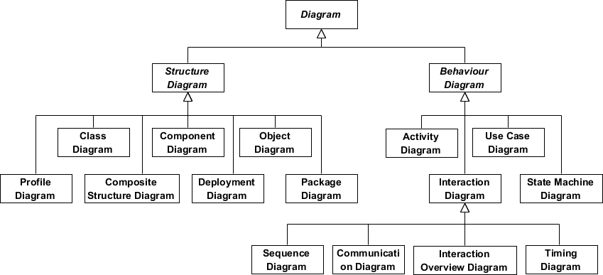

# Was ist ein Klassendiagramm?
Das Klassendiagramm ist eine zentrale Modellierungstechnik, die nahezu alle objektorientierten Methoden durchläuft. Dieses Diagramm beschreibt die Objekttypen im System und verschiedene Arten von statischen Beziehungen, die zwischen ihnen bestehen.

# Beziehungen

Es gibt drei Hauptarten von Beziehungen, die wichtig sind:

- Verein - Beziehungen zwischen Instanzen von Typen ( darstellen, bei denen eine Person für ein Unternehmen arbeitet, ein Unternehmen hat eine Reihe von Büros.
- Vererbung - die offensichtlichste Ergänzung zu ER-Diagrammen zur Verwendung in OO. Es hat eine unmittelbare Entsprechung zur Vererbung im OO-Design.
- Aggregation - Aggregation, eine Form der Objektzusammensetzung im objektorientierten Design.

Beispiel für ein Klassendiagramm

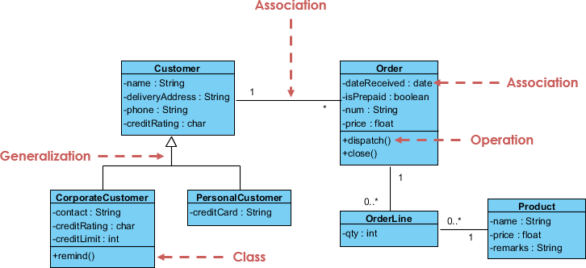

# Was ist Komponentendiagramm?

In der Unified Modeling Language zeigt ein Komponentendiagramm, wie Komponenten zu größeren Komponenten oder Softwaresystemen miteinander verbunden sind. Es zeigt die Architekturen der Softwarekomponenten und die Abhängigkeiten zwischen ihnen. Diese Softwarekomponenten, einschließlich Laufzeitkomponenten, ausführbare Komponenten sowie Quellcodekomponenten.

Beispiel für ein Komponentendiagramm

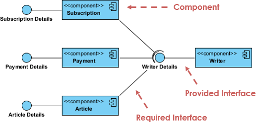

# Was ist ein Bereitstellungsdiagramm?

Das Bereitstellungsdiagramm hilft bei der Modellierung des physischen Aspekts eines objektorientierten Softwaresystems. Es handelt sich um ein Strukturdiagramm, das die Architektur des Systems als Bereitstellung ( -Verteilung ) von Software-Artefakten zu Bereitstellungszielen zeigt. Artefakte stellen konkrete Elemente in der physischen Welt dar, die das Ergebnis eines Entwicklungsprozesses sind. Es modelliert die Laufzeitkonfiguration in einer statischen Ansicht und visualisiert die Verteilung von Artefakten in einer Anwendung. In den meisten Fällen werden die Hardwarekonfigurationen zusammen mit den Softwarekomponenten modelliert, auf denen gelebt wurde.

Beispiel für ein Bereitstellungsdiagramm

# Was ist ein Objektdiagramm?

Ein Objektdiagramm ist ein Diagramm von Instanzen, einschließlich Objekten und Datenwerten. Ein statisches Objektdiagramm ist eine Instanz eines Klassendiagramms. Es zeigt eine Momentaufnahme des detaillierten Zustands eines Systems zu einem bestimmten Zeitpunkt. Der Unterschied besteht darin, dass ein Klassendiagramm ein abstraktes Modell darstellt, das aus Klassen und ihren Beziehungen besteht. Ein Objektdiagramm repräsentiert jedoch eine Instanz zu einem bestimmten Zeitpunkt, die konkreter Natur ist. Die Verwendung von Objektdiagrammen ist ziemlich begrenzt, um Beispiele für Datenstrukturen zu zeigen.

Klassendiagramm gegen Objektdiagramm - Ein Beispiel
Bei einigen Personen fällt es möglicherweise schwer, den Unterschied zwischen einem UML-Klassendiagramm und einem UML-Objektdiagramm zu verstehen, da beide aus benannten "Rechteckblöcken" mit Attributen bestehen, und mit Verknüpfungen dazwischen, die die beiden UML-Diagramme ähnlich aussehen lassen. Einige Leute denken vielleicht sogar, dass sie gleich sind, weil sie im UML-Tool sowohl die Notationen für das Klassendiagramm als auch das Objektdiagramm verwenden und sich in demselben Diagrammeditor befinden - dem Klassendiagramm.

Tatsächlich repräsentieren Klassendiagramm und Objektdiagramm zwei verschiedene Aspekte einer Codebasis. In diesem Artikel geben wir Ihnen einige Ideen zu diesen beiden UML-Diagrammen, was sie sind, was ihre Unterschiede sind und wann sie jedes von ihnen verwenden sollen.

# Beziehung zwischen Klassendiagramm und Objektdiagramm
Sie erstellen "Klassen", wenn Sie programmieren. In einem Online-Banking-System können Sie beispielsweise Klassen wie "Benutzer", "Konto", "Transaktion" usw. erstellen. In einem Klassenzimmerverwaltungssystem können Sie Klassen wie "Lehrer", "Student", "Zuordnung" usw. erstellen. In jeder Klasse gibt es Attribute und Operationen, die das Merkmal und Verhalten der Klasse darstellen. Klassendiagramm ist ein UML-Diagramm, in dem Sie diese Klassen zusammen mit ihren Attributen, Operationen und der Wechselbeziehung visualisieren können.

Das UML-Objektdiagramm zeigt, wie Objektinstanzen in Ihrem System in einem bestimmten Zustand miteinander interagieren. Es repräsentiert auch die Datenwerte dieser Objekte in diesem Zustand. Mit anderen Worten, ein UML-Objektdiagramm kann als Darstellung der Verwendung von Klassen ( in UML-Klassendiagramm ) in einem bestimmten Zustand angesehen werden.

Wenn Sie kein Fan dieser Definitionsmaterialien sind, sehen Sie sich die folgenden Beispiele für UML-Diagramme an. Ich glaube, dass Sie ihre Unterschiede in Sekunden verstehen werden.

# Beispiel für ein Klassendiagramm
Das folgende Beispiel für ein Klassendiagramm repräsentiert zwei Klassen - Benutzer und Anhang. Ein Benutzer kann mehrere Anhänge hochladen, sodass die beiden Klassen mit einer Zuordnung verbunden sind, wobei 0 .. * auf der Anhangsseite als Multiplizität verwendet wird.

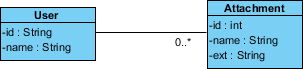

Beispiel für ein Objektdiagramm
Das folgende Beispiel für ein Objektdiagramm zeigt Ihnen, wie die Objektinstanzen der Benutzer- und Anhangsklasse im Moment "aussehen". Peter ( d.h. Der Benutzer ) versucht, zwei Anhänge hochzuladen. Es gibt also zwei Instanzspezifikationen für die beiden zu hochladenden Anhangsobjekte.

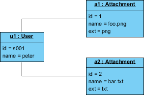

# Was ist ein Paketdiagramm?
Das Paketdiagramm ist ein UML-Strukturdiagramm, das Pakete und Abhängigkeiten zwischen den Paketen zeigt. Modelldiagramme ermöglichen es, verschiedene Ansichten eines Systems anzuzeigen, beispielsweise als mehrschichtige ( aka mehrstufige ) -Anwendung - mehrschichtiges Anwendungsmodell.

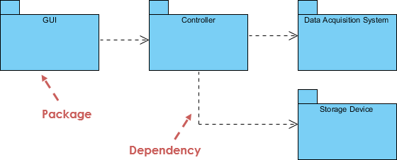

# Was ist ein zusammengesetztes Strukturdiagramm?
Das zusammengesetzte Strukturdiagramm ist eines der neuen Artefakte, die UML 2.0 hinzugefügt wurden. Ein zusammengesetztes Strukturdiagramm ähnelt einem Klassendiagramm und ist eine Art Komponentendiagramm, das hauptsächlich zur Modellierung eines Systems am Mikropunkt verwendet wird, aber es zeigt einzelne Teile anstelle von ganzen Klassen. Es ist eine Art statisches Strukturdiagramm, das die interne Struktur einer Klasse und die Zusammenarbeit zeigt, die diese Struktur ermöglicht.

Dieses Diagramm kann interne Teile, Ports enthalten, über die die Teile miteinander interagieren oder über die Instanzen der Klasse mit den Teilen und mit der Außenwelt interagieren, und Anschlüsse zwischen Teilen oder Anschlüssen. Eine zusammengesetzte Struktur ist eine Reihe miteinander verbundener Elemente, die zur Laufzeit zusammenarbeiten, um einen bestimmten Zweck zu erreichen. Jedes Element hat eine definierte Rolle in der Zusammenarbeit.

## Beispiel für ein zusammengesetztes Strukturdiagramm

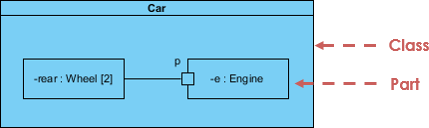

# Was ist ein Profildiagramm?
Mit einem Profildiagramm können Sie domänen- und plattformspezifische Stereotypen erstellen und die Beziehungen zwischen ihnen definieren. Sie können Stereotypen erstellen, indem Sie stereotype Formen zeichnen und sie über die ressourcenorientierte Benutzeroberfläche mit Komposition oder Verallgemeinerung in Beziehung setzen. Sie können auch markierte Werte von Stereotypen definieren und visualisieren.

## Beispiel für ein Profildiagramm

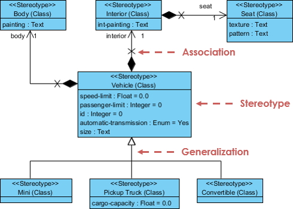

Was ist ein Anwendungsfalldiagramm?
Ein Anwendungsfallmodell beschreibt die funktionalen Anforderungen eines Systems in Bezug auf Anwendungsfälle. Es ist ein Modell der beabsichtigten Funktionalität des Systems ( Anwendungsfälle ) und seiner Umgebung ( Wirkstoffe ). In Anwendungsfällen können Sie das, was Sie von einem System benötigen, mit der Leistung des Systems in Verbindung bringen.

Stellen Sie sich ein Anwendungsmodell als Menü vor, ähnlich wie das Menü, das Sie in einem Restaurant finden. Wenn Sie sich die Speisekarte ansehen, wissen Sie, was Ihnen zur Verfügung steht, die einzelnen Gerichte sowie deren Preise. Sie wissen auch, welche Art von Küche das Restaurant serviert: Italienisch, Mexikanisch, Chinesisch und so weiter. Wenn Sie sich die Speisekarte ansehen, erhalten Sie einen Gesamteindruck des kulinarischen Erlebnisses, das Sie in diesem Restaurant erwartet. Das Menü "moduliert" tatsächlich das Verhalten des Restaurants.

Da es sich um ein sehr leistungsstarkes Planungsinstrument handelt, wird das Anwendungsfallmodell im Allgemeinen in allen Phasen des Entwicklungszyklus von allen Teammitgliedern verwendet.

Verwenden Sie das Beispiel für ein Falldiagramm

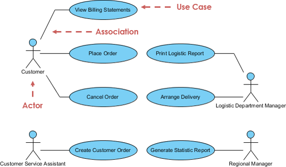

# Was ist ein Aktivitätsdiagramm?
Aktivitätsdiagramme sind grafische Darstellungen von Workflows schrittweiser Aktivitäten und Aktionen mit Unterstützung für Auswahl, Iteration und Parallelität. Es beschreibt den Kontrollfluss des Zielsystems, z. B. die Untersuchung komplexer Geschäftsregeln und -vorgänge, und beschreibt den Anwendungsfall sowie den Geschäftsprozess. In der Unified Modeling Language sollen Aktivitätsdiagramme sowohl Rechen- als auch Organisationsprozesse ( d.h. Workflows ).

## Aktivitätsdiagramm Beispiel

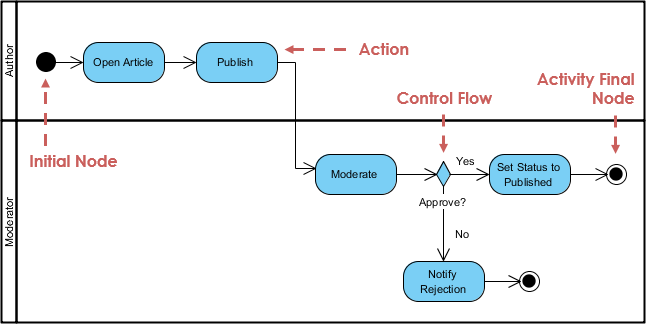

# Was ist ein Staatsmaschinendiagramm?
Ein Zustandsdiagramm ist eine Art Diagramm, das in UML verwendet wird, um das Verhalten von Systemen zu beschreiben, das auf dem Konzept von Zustandsdiagrammen von David Harel basiert. Staatsdiagramme zeigen die zulässigen Zustände und Übergänge sowie die Ereignisse, die diese Übergänge beeinflussen. Es hilft, den gesamten Lebenszyklus von Objekten zu visualisieren und so ein besseres Verständnis der staatlichen Systeme zu ermöglichen.

## Beispiel für ein Zustandsmaschinendiagramm

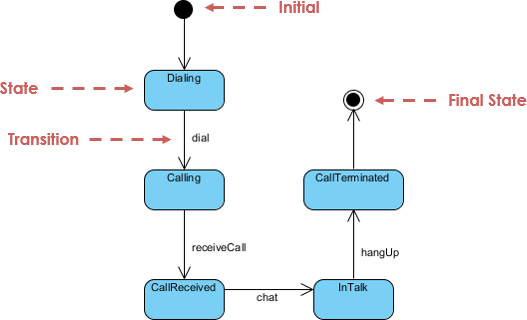

# Was ist ein Sequenzdiagramm?

Das Sequenzdiagramm modelliert die Zusammenarbeit von Objekten anhand einer Zeitfolge. Es zeigt, wie die Objekte in einem bestimmten Szenario eines Anwendungsfalls mit anderen interagieren. Mit der erweiterten visuellen Modellierungsfunktion können Sie mit wenigen Klicks ein komplexes Sequenzdiagramm erstellen. Außerdem kann ein Modellierungswerkzeug wie Visual Paradigm ein Sequenzdiagramm aus dem Ereignisfluss generieren, den Sie in der Anwendungsfallbeschreibung definiert haben.

## Beispiel für ein Sequenzdiagramm

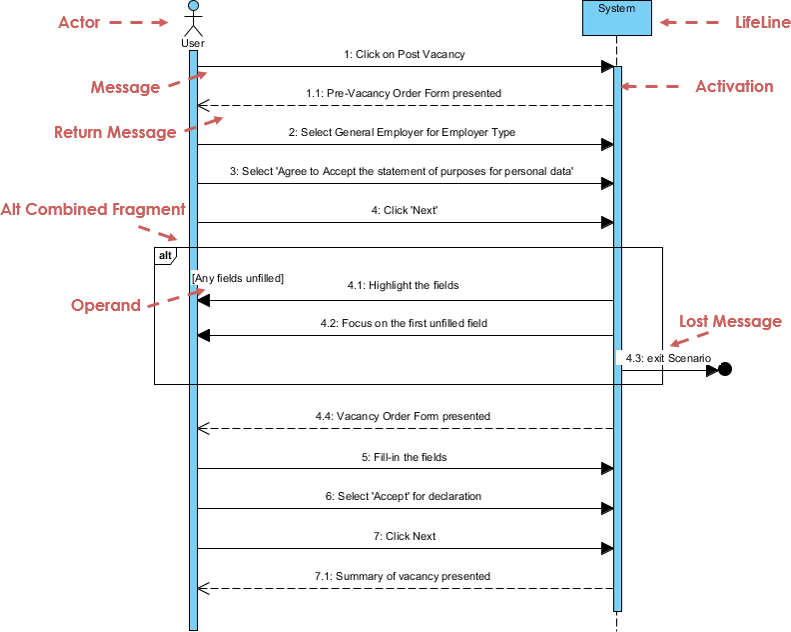

# Was ist ein Kommunikationsdiagramm?

Ähnlich wie beim Sequenzdiagramm wird das Kommunikationsdiagramm auch verwendet, um das dynamische Verhalten des Anwendungsfalls zu modellieren. Im Vergleich zum Sequenzdiagramm konzentriert sich das Kommunikationsdiagramm eher auf die Darstellung der Zusammenarbeit von Objekten als auf die Zeitfolge. Sie sind tatsächlich semantisch äquivalent, sodass Sie mit einigen Modellierungswerkzeugen wie Visual Paradigm von einem zum anderen generieren können.

## Beispiel für ein Kommunikationsdiagramm

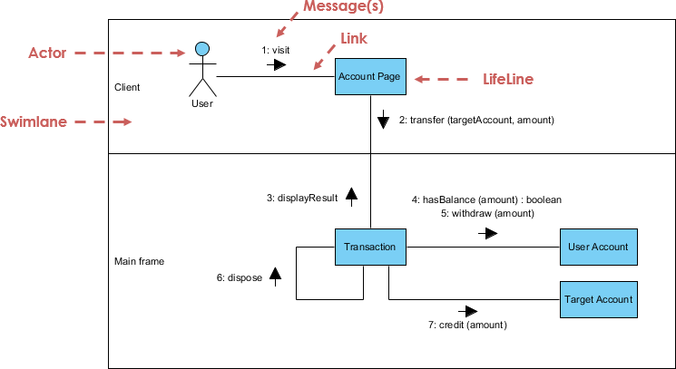

# Was ist das Diagramm zur Interaktionsübersicht?

Das Interaktionsübersichtsdiagramm konzentriert sich auf die Übersicht über den Kontrollfluss der Interaktionen. Es ist eine Variante des Aktivitätsdiagramms, bei der die Knoten die Wechselwirkungen oder Wechselwirkungsereignisse sind. Das Interaktionsübersichtsdiagramm beschreibt die Interaktionen, in denen Nachrichten und Lebensadern ausgeblendet sind. Sie können die "echten" Diagramme verknüpfen und eine hohe Navigationsfähigkeit zwischen Diagrammen im Interaktionsübersichtsdiagramm erreichen.

## Beispiel für eine Interaktionsübersicht

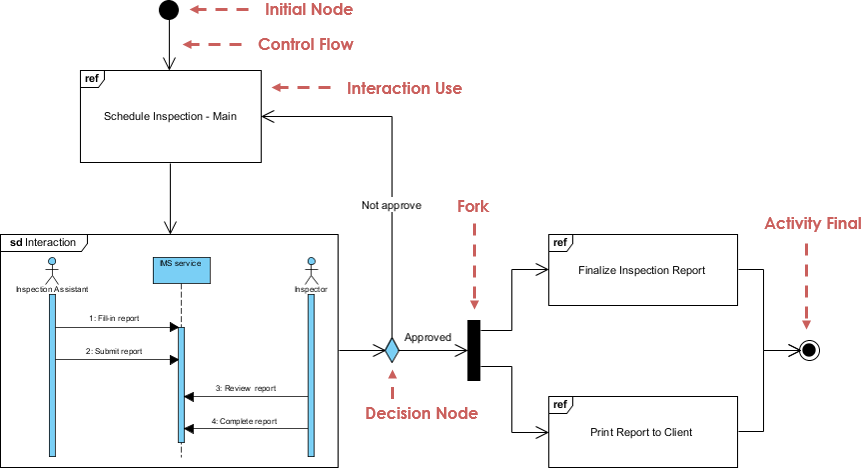

# Was ist Timing Diagram?

Das Zeitdiagramm zeigt das Verhalten des Objekts ( s ) in einem bestimmten Zeitraum. Das Zeitdiagramm ist eine spezielle Form eines Sequenzdiagramms. Die Unterschiede zwischen Zeitdiagramm und Sequenzdiagramm sind, dass die Achsen umgekehrt sind, so dass die Zeit von links nach rechts und die Lebensadern in getrennten, vertikal angeordneten Fächern angezeigt werden.

## Beispiel für ein Zeitdiagramm

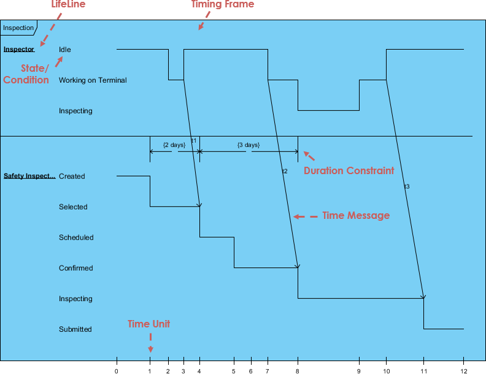

<section id="uml-glossary-terms" data-magellan-target="uml-glossary-terms">
<h2>UML-Glossar und Begriffe</h2>
<ul>
<li><b>Abstrakte Klasse</b> - Eine Klasse, die niemals instanziiert wird. Eine Instanz dieser Klasse wird niemals existieren.</li>
<li><b>Schauspieler</b> - Ein Objekt oder eine Person, die Ereignisse initiiert, an denen das System beteiligt ist.</li>
<li><b>Aktivität</b>: Ein Schritt oder eine Aktion innerhalb eines Aktivitätsdiagramms. Stellt eine Aktion dar, die vom System oder von einem Schauspieler ergriffen wurde. </li>
<li><b>Aktivitätsdiagramm</b>: Ein verherrlichtes Flussdiagramm, das die Schritte und Entscheidungen sowie parallele Vorgänge innerhalb eines Prozesses zeigt, z. B. einen Algorithmus oder einen Geschäftsprozess.</li>
<li><b>Aggregation</b> - Ist ein Teil einer anderen Klasse. In Diagrammen mit einem hohlen Diamanten neben der enthaltenden Klasse dargestellt.</li>
<li><b>Artefakte</b> - Dokumente, die die Ausgabe eines Schritts im Entwurfsprozess beschreiben. Die Beschreibung ist grafisch, textuell oder eine Kombination.</li>
<li><b>Verein</b> - Eine Verbindung zwischen zwei Elementen eines Modells. Dies kann eine Mitgliedsvariable im Code oder die Zuordnung zwischen einem Personaldatensatz und der Person, die er vertritt, oder eine Beziehung zwischen zwei Kategorien von Arbeitnehmern oder einer ähnlichen Beziehung darstellen. Standardmäßig sind beide Elemente in einer Vereinigung gleich und kennen sich über die Vereinigung. Eine Vereinigung kann auch eine schiffbare Vereinigung sein, was bedeutet, dass das Quellende der Vereinigung das Zielende kennt, aber nicht umgekehrt.</li>
<li><b>Assoziationsklasse</b>: Eine Klasse, die Informationen darstellt und der Vereinigung zwischen zwei anderen Klassen hinzufügt.</li>
<li><b>Attribute</b> - Eigenschaften eines Objekts, mit denen auf andere Objekte verwiesen oder Objektstatusinformationen gespeichert werden können.</li>
<li><b>Basisklasse</b>: Eine Klasse, die Attribute und Operationen definiert, die von einer Unterklasse über eine Verallgemeinerungsbeziehung geerbt werden.</li>
<li><b>Zweigstelle</b>: Ein Entscheidungspunkt in einem Aktivitätsdiagramm. Aus dem Zweig ergeben sich mehrere Übergänge mit jeweils einer Schutzbedingung. Wenn die Kontrolle den Zweig erreicht, muss genau eine Schutzbedingung wahr sein. und die Kontrolle folgt dem entsprechenden Übergang. </li>
<li><b>Klasse</b>: Eine Kategorie ähnlicher Objekte, die alle mit denselben Attributen und Operationen und allen zuweisungskompatiblen Objekten beschrieben werden. </li>
<li><b>Klassendiagramm</b> - Zeigt die Systemklassen und Beziehungen zwischen ihnen an.</li>
<li><b>Klassifizierer</b>: Ein UML-Element mit Attributen und Operationen. Insbesondere Schauspieler, Klassen und Schnittstellen.</li>
<li><b>Zusammenarbeit</b>: Eine Beziehung zwischen zwei Objekten in einem Kommunikationsdiagramm, die angibt, dass Nachrichten zwischen den Objekten hin und her gehen können.</li>
<li><b>Kommunikationsdiagramm</b> - Ein Diagramm, das zeigt, wie Operationen ausgeführt werden, während die Rollen von Objekten hervorgehoben werden.</li>
<li><b>Komponente</b>: Eine einsetzbare Codeeinheit innerhalb des Systems. </li>
<li><b>Komponentendiagramm</b>: Ein Diagramm, das die Beziehungen zwischen verschiedenen Komponenten und Schnittstellen zeigt.</li>
<li><b>Konzept</b> - Ein Substantiv oder eine abstrakte Idee, die in ein Domänenmodell aufgenommen werden soll.</li>
<li><b>Bauphase</b> - Die dritte Phase des Rational Unified Process, in der mehrere Iterationen von Funktionen in das im Aufbau befindliche System integriert sind. Hier wird die Hauptarbeit geleistet.</li>
<li><b>Abhängigkeit</b>: Eine Beziehung, die angibt, dass ein Klassifikator die Attribute und Operationen eines anderen Klassifikators kennt, aber nicht direkt mit einer Instanz des zweiten Klassifikators verbunden ist. </li>
<li><b>Bereitstellungsdiagramm</b>: Ein Diagramm, das die Beziehungen zwischen verschiedenen Prozessoren zeigt.</li>
<li><b>Domain</b> -Der Teil des Universums, an dem das System beteiligt ist.</li>
<li><b>Aufarbeitungsphase</b> - Die zweite Phase des rationalen einheitlichen Prozesses, die eine zusätzliche Projektplanung einschließlich der Iterationen der Bauphase ermöglicht.</li>
<li><b>Element</b>: Jedes Element, das in einem Modell angezeigt wird.</li>
<li><b>Einkapselung</b> - Daten in Objekten sind privat.</li>
<li><b>Verallgemeinerung</b> - Zeigt an, dass eine Klasse eine Unterklasse für eine andere Klasse ( Superklasse ) ist. Ein hohler Pfeil zeigt auf die Superklasse.</li>
<li><b>Ereignis</b>: In einem Zustandsdiagramm stellt dies ein Signal oder Ereignis oder eine Eingabe dar, die das System veranlasst, eine Aktion auszuführen oder Staaten zu wechseln.</li>
<li><b>Endzustand</b>: In einem Zustandsdiagramm oder einem Aktivitätsdiagramm zeigt dies einen Punkt an, an dem das Diagramm abgeschlossen ist.</li>
<li><b>Gabel</b>: Ein Punkt in einem Aktivitätsdiagramm, an dem mehrere parallele Steuerthreads beginnen.</li>
<li><b>Verallgemeinerung</b>: Eine Vererbungsbeziehung, in der eine Unterklasse die Attribute und Operationen einer Basisklasse erbt und ergänzt.</li>
<li><b>GoF</b> - Gang of Four Satz von Entwurfsmustern.</li>
<li><b>Hoher Zusammenhalt</b> - Ein GRASP-Bewertungsmuster, das sicherstellt, dass die Klasse nicht zu komplex ist und nicht verwandte Funktionen ausführt.</li>
<li><b>Niedrige Kupplung</b> - Ein GRASP-Bewertungsmuster, das misst, wie sehr sich eine Klasse auf eine andere Klasse stützt oder mit einer anderen Klasse verbunden ist.</li>
<li><b>Inception-Phase</b> - Die erste Phase des rationalen einheitlichen Prozesses, die sich mit der ursprünglichen Konzeptualisierung und dem Beginn des Projekts befasst.</li>
<li><b>Vererbung</b> - Unterklassen erben die Attribute oder Charakteriken ihrer übergeordneten ( Superklasse ). Diese Attribute können in der Unterklasse überschrieben werden.</li>
<li><b>Anfangszustand</b>: In einem Zustandsdiagramm oder einem Aktivitätsdiagramm zeigt dies den Punkt an, an dem das Diagramm beginnt.</li>
<li><b>Instanz</b> - Eine Klasse wird wie eine Vorlage zum Erstellen eines Objekts verwendet. Dieses Objekt wird als Instanz der Klasse bezeichnet. Es kann eine beliebige Anzahl von Instanzen der Klasse erstellt werden.</li>
<li><b>Schnittstelle</b>: Ein Klassifikator, der Attribute und Operationen definiert, die einen Verhaltensvertrag bilden. Eine Anbietersklasse oder -komponente kann sich dafür entscheiden, eine Schnittstelle ( zu realisieren, d. H. Ihre Attribute und Operationen ) zu implementieren. Eine Client-Klasse oder -Komponente kann dann von der Schnittstelle abhängen und somit den Anbieter ohne Details der wahren Klasse des Anbieters verwenden.</li>
<li><b>Iteration</b> - Ein Mini-Projektabschnitt, in dem dem Projekt eine kleine Funktionalität hinzugefügt wird. Enthält die Entwicklungsschleife für Analyse, Design und Codierung.</li>
<li><b>Treten Sie bei</b>: Ein Punkt in einem Aktivitätsdiagramm, an dem mehrere parallele Steuerthreads synchronisiert werden und wieder beitreten.</li>
<li><b>Mitglied</b>: Ein Attribut oder eine Operation innerhalb eines Klassifikators.</li>
<li><b>Zusammenführen</b>: Ein Punkt in einem Aktivitätsdiagramm, an dem verschiedene Steuerpfade zusammenkommen.</li>
<li><b>Nachricht</b> - Eine Anfrage von einem Objekt zum anderen, in der das Objekt, das die Nachricht empfängt, aufgefordert wird, etwas zu tun. Dies ist im Grunde ein Aufruf einer Methode im Empfangsobjekt.</li>
<li><b>Methode</b> - Eine Funktion oder Prozedur in einem Objekt.</li>
<li><b>Modell</b> - Das zentrale UML-Artefakt. Besteht aus verschiedenen Elementen, die in einer Hierarchie von Paketen angeordnet wurden, auch mit Beziehungen zwischen Elementen.</li>
<li><b>Multiplizität</b> - In einem Domänenmodell dargestellt und außerhalb von Konzeptfeldern angegeben, zeigt es die Beziehung der Objektmenge zu Quantilen anderer Objekte an.</li>
<li><b>Navigationsbarkeit</b>: Zeigt an, welches Ende einer Beziehung das andere Ende kennt. Beziehungen können bidirektionale Navigationsfähigkeit ( aufweisen. Jedes Ende kennt das andere ) oder die einfach gerichtete Navigationsfähigkeit (. Ein Ende ist sich des anderen bewusst, aber nicht umgekehrt ).</li>
<li><b>Notation</b> - Grafisches Dokument mit Regeln zum Erstellen von Analyse- und Entwurfsmethoden.</li>
<li><b>Hinweis</b>: Eine Textnotiz, die einem Diagramm hinzugefügt wurde, um das Diagramm genauer zu erläutern.</li>
<li><b>Objekt</b> - Objekt: In einem Aktivitätsdiagramm ein Objekt, das Informationen von Aktivitäten empfängt oder Informationen zu Aktivitäten bereitstellt. In einem Kollaborationsdiagramm oder einem Sequenzdiagramm ein Objekt, das an dem im Diagramm dargestellten Szenario teilnimmt. Im Allgemeinen: eine Instanz oder ein Beispiel eines bestimmten Klassifizierers ( Schauspieler, Klasse oder Schnittstelle ). </li>
<li><b>Paket</b> - Eine Gruppe von UML-Elementen, die logisch zusammengefasst werden sollten.</li>
<li><b>Paketdiagramm</b>: Ein Klassendiagramm, in dem alle Elemente Pakete und Abhängigkeiten sind.</li>
<li><b>Muster</b> - Lösungen zur Bestimmung der Verantwortungszuweisung für zu interagierende Objekte. Es ist ein Name für eine erfolgreiche Lösung eines bekannten gemeinsamen Problems.</li>
<li><b>Parameter</b>: Ein Argument für eine Operation.</li>
<li><b>Polymorphismus</b> - Gleiche Nachricht, andere Methode. Wird auch als Muster verwendet.</li>
<li><b>Privat</b>: Eine Sichtbarkeitsstufe, die auf ein Attribut oder eine Operation angewendet wird und angibt, dass nur Code für den Klassifikator, der das Mitglied enthält, auf das Mitglied zugreifen kann.</li>
<li><b>Prozessor</b>: In einem Bereitstellungsdiagramm stellt dies einen Computer oder ein anderes programmierbares Gerät dar, auf dem Code bereitgestellt werden kann. </li>
<li><b>Geschützt</b>: Eine Sichtbarkeitsstufe, die auf ein Attribut oder eine Operation angewendet wird und angibt, dass nur Code für den Klassifikator, der das Mitglied enthält, oder für seine Unterklassen auf das Mitglied zugreifen kann.</li>
<li><b>Öffentlichkeit</b>: Eine Sichtbarkeitsstufe, die auf ein Attribut oder eine Operation angewendet wird und angibt, dass jeder Code auf das Mitglied zugreifen kann.</li>
<li><b>Richtungspfeil lesen</b> - Zeigt die Richtung einer Beziehung in einem Domänenmodell an.</li>
<li><b>Realisierung</b>: Zeigt an, dass eine Komponente oder eine Klasse eine bestimmte Schnittstelle bereitstellt.</li>
<li><b>Rolle</b> - In einem Domänenmodell wird optional die Rolle eines Akteurs beschrieben.</li>
<li><b>Sequenzdiagramm</b>: Ein Diagramm, das die Existenz von Objekten im Laufe der Zeit und die Nachrichten zeigt, die zwischen diesen Objekten im Laufe der Zeit verlaufen, um ein gewisses Verhalten auszuführen. Zustandsdiagramm - Ein Diagramm, das alle möglichen Objektzustände zeigt.</li>
<li><b>Staat</b>: In einem Zustandsdiagramm repräsentiert dies einen Zustand eines Systems oder Subsystems: das, was es zu einem bestimmten Zeitpunkt tut, sowie die Werte seiner Daten. </li>
<li><b>Staatsdiagramm</b>: Ein Diagramm, das Zustände eines Systems oder Teilsystems, Übergänge zwischen Staaten und die Ereignisse zeigt, die die Übergänge verursachen.</li>
<li><b>Statisch</b>: Ein Modifikator für ein Attribut, der angibt, dass nur eine Kopie des Attributs für alle Instanzen des Klassifikators freigegeben ist. Ein Modifikator für eine Operation, der angibt, dass die Operation für sich allein steht und nicht mit einer bestimmten Instanz des Klassifikators arbeitet.</li>
<li><b>Stereotyp</b>: Ein Modifikator, der auf ein Modellelement angewendet wird und etwas darüber anzeigt, das normalerweise nicht in UML ausgedrückt werden kann. Mit Stereotypen können Sie im Wesentlichen Ihren eigenen "Dialekt" von UML definieren.</li>
<li><b>Unterklasse</b>: Eine Klasse, die Attribute und Operationen erbt, die von einer Unterklasse über eine Verallgemeinerungsbeziehung definiert werden.</li>
<li><b>Swimlane</b>: Ein Element eines Aktivitätsdiagramms, das angibt, welche Teile eines Systems oder einer Domäne bestimmte Aktivitäten ausführen. Alle Aktivitäten innerhalb eines Swimlane liegen in der Verantwortung des Objekts, der Komponente oder des Schauspielers, die durch den Swimlane dargestellt werden.</li>
<li><b>Zeitboxen</b> - Jede Iteration hat ein Zeitlimit mit bestimmten Zielen.</li>
<li><b>Übergang</b>: Stellt in einem Aktivitätsdiagramm einen Kontrollfluss von einer Aktivität oder einem Zweig oder einer Fusion oder Gabel dar oder Join to aone dar. In einem Staatsdiagramm steht ein Wechsel von einem Staat in einen anderen. </li>
<li><b>Übergangsphase</b> - Die letzte Phase des rationalen einheitlichen Prozesses, in der Benutzer in der Verwendung des neuen Systems und des Systems geschult werden, wird den Benutzern zur Verfügung gestellt.</li>
<li><b>UML</b> - Unified Modeling Language verwendet Text- und Grafikdokumente, um die Analyse und das Design von Softwareprojekten zu verbessern, indem kohärentere Beziehungen zwischen Objekten ermöglicht werden.</li>
<li><b>Anwendungsfall</b>: In einem Anwendungsfalldiagramm stellt es eine Aktion dar, die das System als Antwort auf eine Anfrage eines Schauspielers ausführt. </li>
<li><b>Anwendungsfalldiagramm</b>: Ein Diagramm, das die Beziehungen zwischen Schauspielern und Anwendungsfällen zeigt.</li>
<li><b>Sichtweite</b>: Ein Modifikator für ein Attribut oder eine Operation, der angibt, welcher Code Zugriff auf das Mitglied hat. Zu den Sichtstufen gehören Öffentlich, Geschützt und Privat.</li>
<li><b>Workflow</b> - Eine Reihe von Aktivitäten, die ein bestimmtes Ergebnis liefern.</li>
</ul>
</section>
